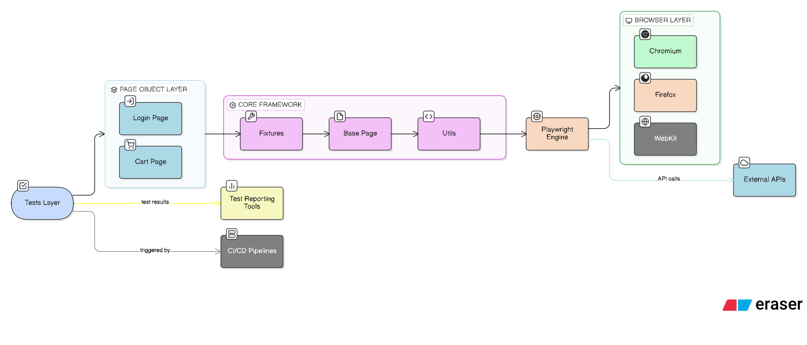

# Playwright TypeScript Automation Framework


<!-- BADGES_START -->


<!-- BADGES_END -->


[](https://ash-leypereira.github.io/playwright-ts-framework)

<!-- TEST_RESULTS_START -->

## 🚀 Automation Execution Status

| Metric | Value |
|------|------|
| Total Tests | 18 |
| Passed | 9 |
| Failed | 9 |
| Skipped | 0 |
| Pass Rate | 50.00% |
| Stability Score | 50.00% |
| Last Run | 2026-04-29 |

<!-- TEST_RESULTS_END -->

## 📊 Automation Analytics Dashboard

View automation trends here:

[View Dashboard](https://ash-leypereira.github.io/playwright-ts-framework/dashboard/index.html)

## Framework Architecture



A scalable and maintainable end-to-end test automation framework built using Playwright, TypeScript, Page Object Model, and Allure Reporting.

This repository demonstrates modern QA automation practices including:

- Page Object Model architecture  
- centralized reporting  
- CI/CD integration  
- containerized test execution  
- scalable test structure  

---

# 🚀 Tech Stack

| Technology | Purpose |
|---|---|
| Playwright | UI automation |
| TypeScript | Type-safe scripting |
| Node.js | Runtime |
| Allure | Advanced reporting |
| GitHub Actions | CI/CD |
| Docker | Containerized execution |

---

# 📂 Project Structure
```
playwright-ts-framework
│
├── tests
│   ├── ui                                  # UI Tests
│   │
│   └── api                                 # API Tests
│
├── src
│   ├── pages                               # Page Objects
│   │
│   ├── api                                 # API Library
│   │
│   ├── config                              # Envrionment Configurations
│   │
│   ├── data                                # Test data Library
│   │
│   └── core
│       ├── base                            # Base page
│       │
│       ├── fixtures                        # Reusable Test Fixtures
│       │
|       └── utils                           # Utility Helper Library
│
├── scripts                                 # Reporting Reusable Scripts
│
├── analytics                               # Analytics Dashboard Library
│
├── logs                                    # Log Operation Data
│
├── reports                                 # Generated Reports Data
│   ├── html-report
│   │
│   ├── allure-results
│   │
│   ├── allure-report
│   │
│   └── test-results
│
├── .github
│   └── workflows                           # Github Actions Workflows
│
├── docs                                    # Framework Documentations 
│
├── playwright.config.ts                    # Playwright Configurations
│
├── package.json                            # Node.js Dependencies
│
├── package-lock.json                       # Node.js Dependencies (lock)
│
├── .gitignore                              # Ignore file (Git)
│
└── Dockerfile                              # Docker setup for framework
```

---

# ⚙️ Installation

Clone the repository:

```bash
git clone https://github.com/Ash-leyPereira/playwright-ts-framework.git
cd playwright-ts-framework
```

Install dependencies:

```bash
npm install
```

Install Playwright browsers:

```bash
npx playwright install
```

---

# ▶️ Running Tests

Run all tests:

```bash
npm run test
```

Run a specific test:

```bash
npx playwright test tests/example.spec.ts
```

Run tests in headed mode:

```bash
npx playwright test --headed
```

Run tests in debug mode:

```bash
npx playwright test --debug
```

---

# 📊 Test Reports

## Playwright HTML Report

After execution:

```bash
npx playwright show-report
```

The report will be available in:

```
reports/html-report
```

---

## Allure Report

Generate Allure report:

```bash
npm run allure:generate
```

Open the report:

```bash
npm run allure:open
```

Allure artifacts are stored inside:

```
reports/
 ├── allure-results
 └── allure-report
```

---

# 🐳 Running Tests with Docker

Build Docker image:

```bash
docker build -t playwright-tests .
```

Run tests:

```bash
docker run --rm playwright-tests
```

Run tests and export reports locally:

```bash
docker run -v $(pwd)/reports:/app/reports playwright-tests
```

---

# ⚡ Continuous Integration (CI)

Automated tests run using GitHub Actions.

Pipeline triggers:

- push to `main` or `master`

CI pipeline performs:

1. dependency installation
2. browser setup
3. test execution
4. report generation
5. artifact upload

Reports are downloadable from the GitHub Actions run artifacts.

---

# 🧩 Framework Architecture

```
Tests
   ↓
Fixtures
   ↓
Page Objects
   ↓
Utilities / Helpers
   ↓
Playwright Core
```

This layered architecture improves:

- maintainability
- test readability
- code reuse
- scalability

---

# 🧪 Key Features

✔ Playwright + TypeScript automation  
✔ Page Object Model design  
✔ centralized reporting structure  
✔ GitHub Actions CI integration  
✔ Docker support  
✔ modular and scalable test architecture  

---

# 📌 Future Enhancements

Planned improvements:

- API testing integration
- environment-based configuration
- visual regression testing
- test data management
- parallel execution optimization

---

# 👨‍💻 Author

Ashley Pereira  
Senior QA Automation Engineer  

GitHub: https://github.com/Ash-leyPereira